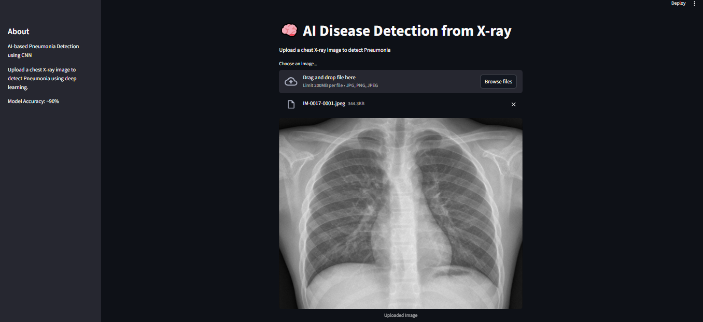

# 🧠 AI-Based Pneumonia Detection from Chest X-rays

This project is a **Deep Learning-based web application** that detects **Pneumonia** from chest X-ray images using a **Convolutional Neural Network (CNN)**.  

The system is built with **TensorFlow/Keras** for model training and **Streamlit** for an interactive user interface.

---

## 🚀 Features

- Upload chest X-ray images (JPG, PNG, JPEG)
- Detect **Pneumonia** or **Normal**
- Displays prediction with **confidence score**
- Visual **progress bar** for confidence
- Simple and user-friendly interface
- Model accuracy: **~90%**

---

## 📁 Project Structure
pneumonia-detection-cnn/
│
├── data/
│   ├── train/
│   │   ├── NORMAL/
│   │   └── PNEUMONIA/
│   │
│   ├── test/
│   │   ├── NORMAL/
│   │   └── PNEUMONIA/
│   │
│   └── val/
│       ├── NORMAL/
│       └── PNEUMONIA/
│
├── models/
│   └── cnn_model.h5
│
├── app/
│   └── streamlit_app.py
│
├── train_cnn.py
│
├── outputs/
│   ├── accuracy_plot.png
│   └── loss_plot.png
|
├── screenshots/
│   └── app.png
|
├── requirements.txt
├── README.md


---

## 🧠 Model Details

- Model Type: Convolutional Neural Network (CNN)
- Input Size: 224 × 224 images
- Output: Binary classification  
  - 0 → Normal  
  - 1 → Pneumonia  
- Loss Function: Binary Crossentropy  
- Optimizer: Adam  

---

## 📊 Dataset

The model is trained on the **Chest X-ray Pneumonia Dataset**.

🔗 Dataset Link:  
https://www.kaggle.com/paultimothymooney/chest-xray-pneumonia

---

## ⚙️ Installation & Setup

### 1. Clone the repository

git clone https://github.com/MuhammadShayan8401/pneumonia-detection-cnn.git

---

### 2. Install dependencies

pip install -r requirements.txt

---

### 3. Run the application

streamlit run app/streamlit_app.py

---

## 🖥️ Usage

1. Run the Streamlit app  
2. Upload a chest X-ray image  
3. View the prediction result  
4. Check confidence score and progress bar  

---

## 📸 Screenshot



---

## 🧠 Model Training

The trained model is not included due to GitHub file size limits.

You can train the model yourself using:

```bash
python train_cnn.py

---

## 📈 Results

- Model Accuracy: **~90%**
- Fast real-time predictions
- Works best with clear chest X-ray images

---

## ⚠️ Limitations

- Depends on dataset quality
- Not a replacement for medical professionals
- Limited to Pneumonia detection only

---

## 🚀 Future Improvements

- Multi-disease detection (COVID-19, TB, etc.)
- Heatmap visualization (Grad-CAM)
- Cloud deployment (Streamlit Cloud / AWS)
- Mobile application integration

---

## 📝 Conclusion

This project demonstrates how **deep learning can assist in medical diagnosis** by automating the detection of Pneumonia from chest X-rays. It provides a simple and efficient tool for quick predictions.

---

## 👨‍💻 Author

**Muhammad Shayan Ahmed**  
GitHub: https://github.com/MuhammadShayan8401

---

## 📜 License

This project is for **educational purposes**.